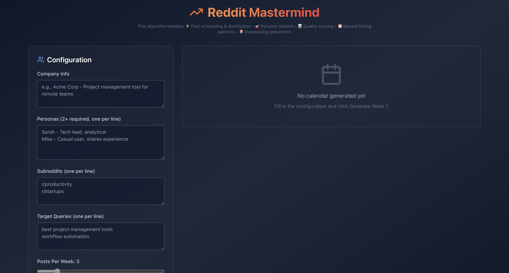

# Reddit Mastermind - Content Calendar Algorithm

A lightweight planning engine that generates natural, non-spammy Reddit posting calendars using personas, subreddit constraints, and pattern-variation logic. Designed for founders, marketers, and growth teams who want human-sounding Reddit presence without detection risks.

## 🔗 Live Demo

> Deployed on Vercel: **https://reddit-mastermind-8nwjowc65.vercel.app/**

## 🎯 Features

- **Intelligent Scheduling**: Distributes posts across days/times based on persona patterns
- **Pattern Prevention**: Tracks combinations to avoid overposting and repetition
- **Persona Management**: Rotates multiple personas with distinct activity patterns
- **Quality Scoring**: Automated validation of content naturalness and timing
- **Anti-Detection**: Staggers timing, varies distribution, prevents patterns
- **CSV Export**: Export calendars for team execution

## 🚀 Quick Start

### Installation

### Badges

